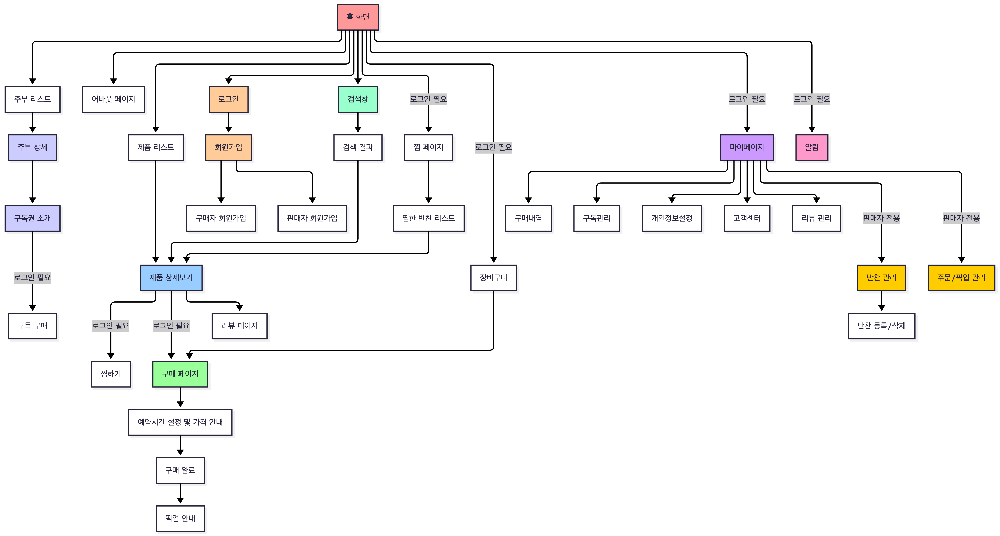

# 잇다 (Eat-da)

> 우리 동네 주부님의 집밥, 정성 가득 집밥 한 끼

<!-- 프로젝트 대표 이미지/배너 -->


<div align="center">

### [🍚배포 링크🍚](https://eat-da.vercel.app/)

---


</div>

<br>

## 목차

1. [프로젝트 소개](#프로젝트-소개)
2. [팀원 소개](#팀원-소개)
3. [주요 기능](#주요-기능)
4. [페이지 구조 & 흐름도](#페이지-구조--흐름도)
5. [시연 영상](#시연-영상)
6. [회고](#회고)

<br>

## 프로젝트 소개

**잇다**는 주부의 손맛을 수익으로 전환하고, 자취생에게는 신뢰할 수 있는 집밥을 제공하는 동네 기반 반찬 플랫폼입니다. '동네 픽업'을 통해 같은 지역의 주부와 자취생을 연결하며, 단순한 상품 거래를 넘어 신뢰 기반의 관계를 만드는 것을 목표로 합니다.

### 잇다의 핵심 특징

1. **동네 기반 픽업** - 배달이 아닌 같은 동네 공유주방에서 직접 픽업하는 신뢰할 수 있는 집밥 경험
2. **티어 시스템** - 판매량을 기반으로 주부를 1단부터 9단까지 시각화하여 신뢰도를 직관적으로 표현
3. **손맛 중심 구조** - 공장이 아닌 주부가 직접 만든 정성 가득한 반찬을 판매하는 신뢰 기반 서비스

<br>

## 팀원 소개

<table>
  <tr>
    <td align="center" width="200"><a href="https://github.com/jiyou228">김지유</a></td>
    <td align="center" width="200"><a href="https://github.com/zinapark">박지은</a></td>
    <td align="center" width="200"><a href="https://github.com/nnjys99">장유석</a></td>
    <td align="center" width="200"><a href="https://github.com/UJin1122">이유진</a></td>
  </tr>
  <tr>
    <td align="center"></td>
    <td align="center"></td>
    <td align="center"></td>
    <td align="center"></td>
  </tr>
  <tr>
    <td align="center">PM</td>
    <td align="center">PL & 디자인 총괄</td>
    <td align="center">발표</td>
    <td align="center">서기</td>
  </tr>
  <tr>
    <td align="center"><b>홈</b> / <b>장바구니</b> / <b>구매</b> / <b>위시리스트</b></td>
    <td align="center"><b>주부 목록·상세</b> / <b>반찬 목록·상세</b> / <b>About</b></td>
    <td align="center"><b>로그인</b> / <b>회원가입</b> / <b>리뷰 관리</b></td>
    <td align="center"><b>마이페이지</b> 및 <b>하위 페이지</b></td>
  </tr>
</table>

<br>

## 개발 기간 : 2026.01.14 ~ 2026.02.12 (30일)

<br>

## 주요 기능

### 구매자

| 기능                  | 설명                                 |
| --------------------- | ------------------------------------ |
| **회원가입 / 로그인** | 이메일 기반 회원가입 및 로그인       |
| **홈 / 상품 탐색**    | 추천 상품, 카테고리별 반찬 탐색      |
| **검색**              | 상품 및 판매자 검색                  |
| **상품 상세**         | 상품 정보, 리뷰 확인                 |
| **장바구니**          | 상품 담기, 수량 변경                 |
| **주문 / 결제**       | PortOne 결제, 구독 결제              |
| **픽업 알림**         | 주문 상태 변경 시 실시간 토스트 알림 |
| **찜하기**            | 관심 상품 저장                       |
| **리뷰 작성**         | 구매 후 리뷰 작성                    |
| **마이페이지**        | 주문 내역, 구독 관리, 알림 센터      |

### 판매자

| 기능               | 설명                                          |
| ------------------ | --------------------------------------------- |
| **반찬 등록/수정** | 상품 CRUD 관리                                |
| **주문 관리**      | 실시간 주문 알림 (WebSocket), 주문 상태 변경  |
| **알림 센터**      | 주문 알림 목록 확인 및 읽음 처리              |
| **티어 시스템**    | 리뷰와 판매량 기반 주부 신뢰도 시각화 (1~9단) |

<br>

## 페이지 구조 & 흐름도



```
app/
├── (user)/                     # 인증
│   ├── login/                  # 로그인
│   └── signup/                 # 회원가입
├── home/                       # 홈
├── products/                   # 상품 목록 / 상세
├── search/                     # 검색
├── sellers/                    # 판매자 목록 / 상세 / 구독
├── cart/                       # 장바구니
├── checkout/                   # 주문 / 결제
│   ├── complete/               # 결제 완료
│   └── subscribe/              # 구독 결제
├── account/                    # 계정 관리
├── mypage/                     # 마이페이지
│   ├── banchan/                # 반찬 관리 (판매자)
│   ├── orders/                 # 주문 관리 (판매자)
│   ├── purchases/              # 구매 내역
│   ├── subscription/           # 구독 관리
│   ├── notifications/          # 알림 센터
│   ├── map/                    # 공유주방 지도
│   ├── verify/                 # 본인 인증
│   └── support/                # 고객 지원
├── wishlist/                   # 찜 목록
├── review/                     # 리뷰 관리 / 작성 / 수정
└── about/                      # 소개
```

<br>

## 시연 영상

### 1. 홈 화면

**스플래시 이미지** → **홈**

<!--  -->

앱 진입 시 보이는 메인 화면으로, 오늘의 추천 반찬과 주부님을 한눈에 탐색할 수 있습니다.

---

### 2. 위시리스트

**홈/반찬 목록/상품 상세** → **위시리스트**

<!--  -->

홈이나 상품 페이지에서 마음에 드는 반찬의 하트 버튼을 클릭해 찜하고, 위시리스트에서 찜한 반찬을 한눈에 확인하며 언제든지 주문할 수 있습니다.

---

### 3. 반찬 둘러보기

**홈** → **반찬 목록** → **필터/정렬/검색** → **상품 상세**

<!--  -->

현재 위치한 동네 공유주방 기준으로 반찬이 노출되며, 카테고리 필터·정렬·검색 기능으로 원하는 반찬을 빠르게 찾을 수 있습니다. 상세 페이지에서는 이미지, 가격, 재료, 픽업 정보와 리뷰를 확인할 수 있습니다.

---

### 4. 반찬 주문

**상품 상세** → **장바구니 담기** → **장바구니** → **주문하기** → **결제 완료**
<br>

**상품 상세** → **바로 구매** → **결제 완료**

<!--  -->

상품 상세에서 장바구니에 담은 뒤 수량을 조절하고 주문하거나, 바로 구매를 통해 즉시 결제할 수 있습니다. 픽업 날짜와 시간을 선택한 후 PortOne 결제로 안전하게 주문을 완료합니다.

---

### 5. 판매자 반찬 관리

**마이페이지** → **반찬 관리** → **반찬 등록/수정/삭제**

<!--  -->

판매자가 마이페이지의 '반찬 관리'에서 새로운 반찬을 등록하고, 이름·가격·설명 등을 수정하며, 본인 주소 기준 가까운 공유주방 핀을 설정할 수 있습니다.

---

### 6. 판매자 주문 알림

**구매자 주문** → **실시간 주문 알림** → **알림 센터**

<!--  -->

구매자가 주문하면 판매자에게 WebSocket으로 실시간 토스트 알림이 전달됩니다. 알림 센터에서 읽지 않은 알림을 확인하고, 알림 클릭 시 해당 주문 관리 페이지로 바로 이동할 수 있습니다.

---

### 7. 판매자 주문 관리

**마이페이지** → **주문 관리** → **상태 변경**

<!--  -->

판매자가 '주문 관리'에서 상태별 필터링으로 주문을 확인하고, 대기중 → 승인됨 → 조리완료 → 픽업완료 순서로 주문 상태를 변경하여 픽업을 관리합니다.

---

### 8. 구매 내역

**마이페이지** → **구매 내역** → **주문 상세** → **픽업 상태 확인**

<!--  -->

구매자가 마이페이지의 '구매 내역'에서 날짜별로 주문 내역을 확인하고, 주문 상세에서 주문번호·픽업 장소·픽업 시간·결제 금액을 조회할 수 있습니다. 픽업 완료 시 리뷰 작성 버튼이 활성화됩니다.

---

### 9. 리뷰 작성

**픽업 완료** → **리뷰 관리** → **리뷰 작성/수정/삭제**

<!--  -->

리뷰 관리 페이지에서 '작성 가능한 리뷰'와 '내 리뷰' 탭으로 구분되며, 픽업 완료된 상품에 대해 별점·사진(최대 5장)·후기를 작성할 수 있습니다. 작성된 리뷰는 수정·삭제가 가능합니다.

---

### 10. 구독 서비스

**주부 목록** → **주부 상세** → **구독 결제**
**마이페이지** → **구독 관리**

<!--  -->

**주부 목록**에서 우리 동네에서 정성껏 집밥을 만드시는 주부님들을 만나 구독 상품을 확인한 뒤, 안전한 결제로 구독을 신청하고 **구독 관리**에서 구독 현황을 관리할 수 있습니다.

## 회고

|             | 김지유 | 박지은 | 장유석 | 이유진 |
| ----------- | ------ | ------ | ------ | ------ |
| 소감 한마디 | -      | -      | -      | -      |
| 부족한점    | -      | -      | -      | -      |
| 잘한점      | -      | -      | -      | -      |
